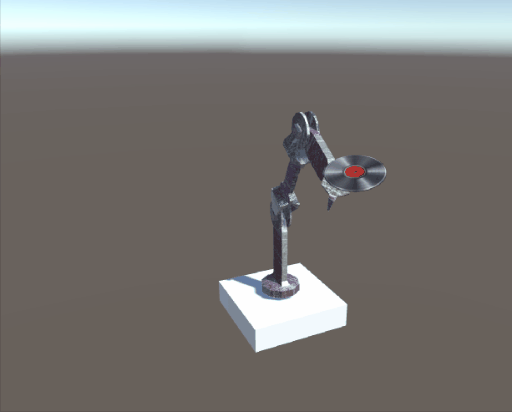

# Лабораторная 1. Робощупальце

Обучите манипулятор попадать в цель с помощью ML Agents Toolkit.

В заготовке реализована модель манипулятора, управляемая с клавиатуры. Дополните скрипт `ManipulatorAgent.cs` кодом для оценки действия агента, подберите подходящий вектор наблюдений и обучите модель с помощью конфига `MLConfigs/Manipulator.yaml`. Конфиг можно менять.

Для ускорения обучения разместите на сцене [множество агентов](https://unity-technologies.github.io/ml-agents/Learning-Environment-Create-New/#optional-multiple-training-areas-within-the-same-scene) или запустите [несколько экземпляров Unity](https://unity-technologies.github.io/ml-agents/Learning-Environment-Create-New/#optional-multiple-training-areas-within-the-same-scene), а для оценки скорости и качества обучения используйте [TensorBoard](https://unity-technologies.github.io/ml-agents/Using-Tensorboard/).